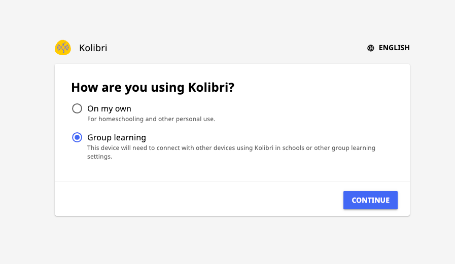
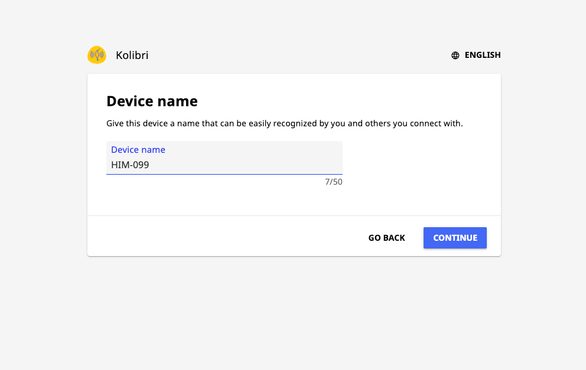
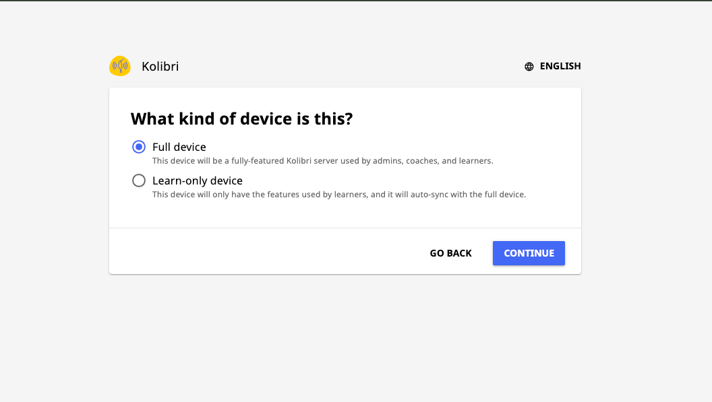
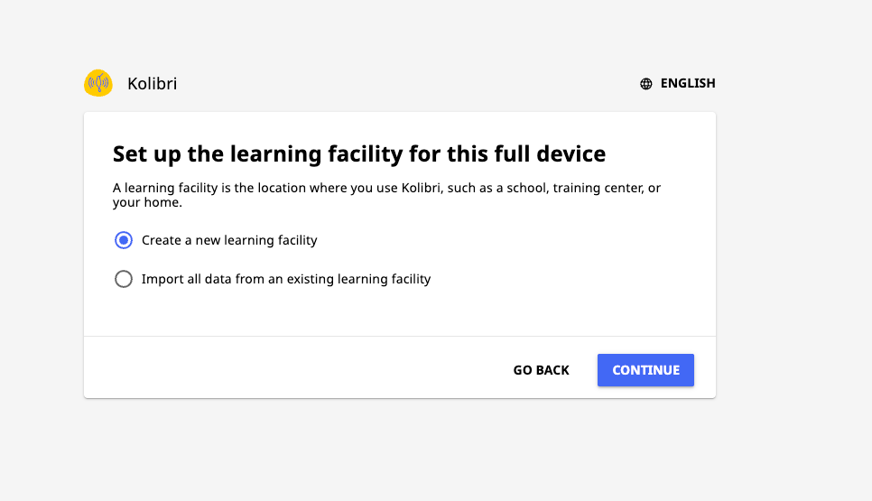
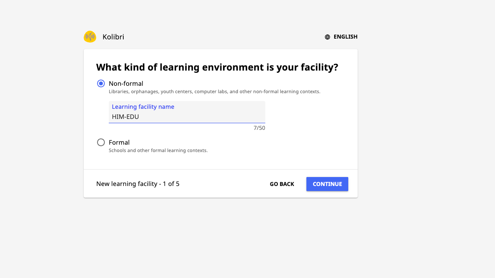
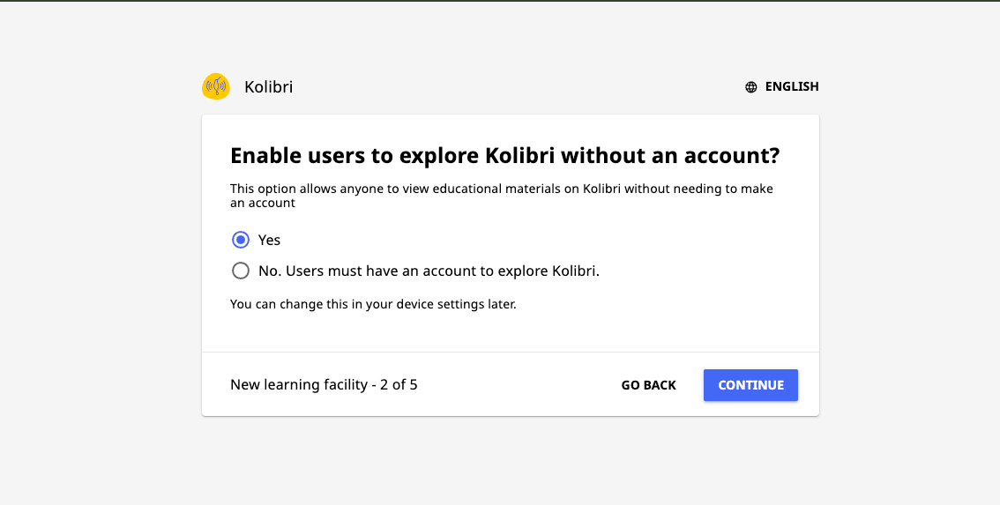
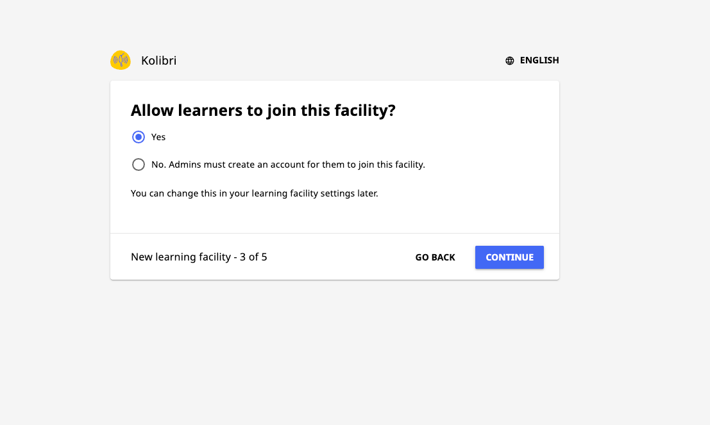
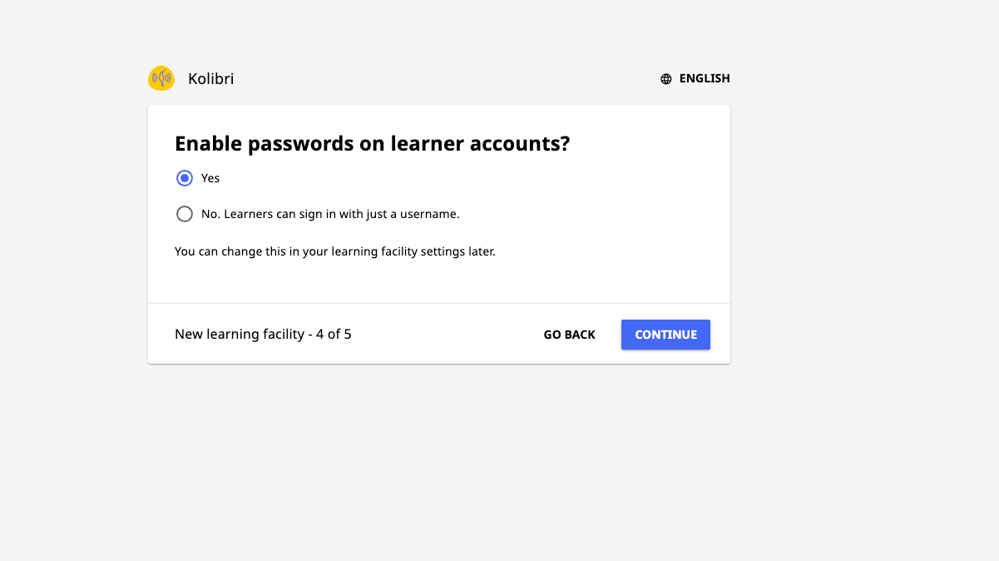
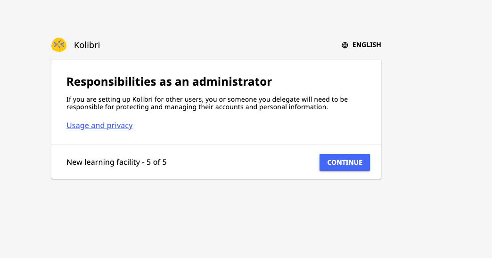
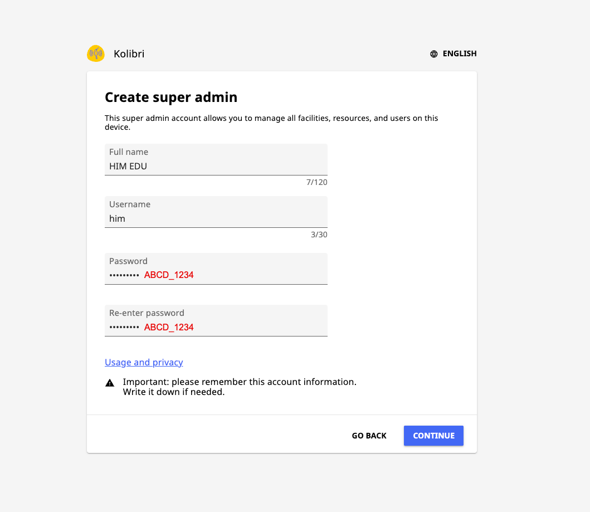

# Kolibri — Offline Learning Platform

## Overview

[Kolibri](https://learningequality.org/kolibri/) is an offline-first learning
platform by Learning Equality. It provides access to curated educational
content (Khan Academy, CK-12, etc.) without an internet connection.

- **URL**: http://10.42.0.1:8080/
- **Runs as**: systemd service (`kolibri`)

---

## First-Time Setup Wizard

When you open Kolibri for the first time at `http://10.42.0.1:8080/`, it will
walk you through a setup wizard. Follow each step exactly as shown below.

---

### Step 1 — How are you using Kolibri?

Select **Group learning** — this server is shared with multiple users in a
school or community setting.



---

### Step 2 — Device Name

Enter the server hostname as the device name (e.g. `HIM-099`).
Use the same `him-xxx` number you assigned during OS installation.



---

### Step 3 — What Kind of Device Is This?

Select **Full device** — this is the main server used by admins, coaches,
and learners.



---

### Step 4 — Set Up the Learning Facility

Select **Create a new learning facility**.



---

### Step 5 — Learning Environment Type

Select **Non-formal** and enter `HIM-EDU` as the facility name.

> Non-formal covers libraries, community centers, and other informal learning
> contexts — which matches HIM Education's use case.



---

### Step 6 — Guest Access

Select **Yes** — allow users to explore Kolibri without creating an account.
This makes the platform accessible to anyone on the Wi-Fi network without
any sign-up required.



---

### Step 7 — Allow Learners to Join

Select **Yes** — learners can create their own accounts to track progress.



---

### Step 8 — Passwords on Learner Accounts

Select **Yes** — require passwords on learner accounts.



---

### Step 9 — Admin Responsibilities

Read and click **Continue**.



---

### Step 10 — Create Super Admin

Fill in the admin account details:

| Field | Value |
|-------|-------|
| Full name | `HIM EDU` |
| Username | `him` |
| Password | `ABCD_1234` |



Click **Continue** — setup is complete.

---

## Installation

### Automatic (via install.sh)

The master `install.sh` script handles Kolibri installation:

1. Checks if Kolibri is already installed (`command -v kolibri`)
2. Looks for a `kolibri*.deb` file in the project directory
3. If no local `.deb`, tries downloading from https://learningequality.org
4. Installs the `.deb` and enables the systemd service

### Manual Installation

```bash
# Download the latest .deb
curl -fsSL -o kolibri-latest.deb https://learningequality.org/r/kolibri-deb-latest

# Install
sudo dpkg -i kolibri-latest.deb
sudo apt-get install -f -y

# Enable and start
sudo systemctl enable --now kolibri
```

---

## Managing Kolibri

### Service Commands

```bash
# Check status
sudo systemctl status kolibri

# Start / Stop / Restart
sudo systemctl start kolibri
sudo systemctl stop kolibri
sudo systemctl restart kolibri

# View logs
journalctl -u kolibri -f
```

---

## Importing Content Channels

### First-Time Download (requires internet + Ethernet)

Use `import-kolibri-channels.sh` after installation. Ethernet must be
connected — the walled-garden Wi-Fi firewall blocks internet traffic.

```bash
# English channels only (~270 GB):
sudo /opt/him-edu/import-kolibri-channels.sh english

# Spanish channels only (~140 GB):
sudo /opt/him-edu/import-kolibri-channels.sh spanish

# Both languages (~410 GB — check disk space first):
df -h
sudo /opt/him-edu/import-kolibri-channels.sh all
```

The script runs `kolibri manage importchannel/importcontent` as the `him`
service user, so all content lands in `/home/him/.kolibri/content/`.

### Manually via the Kolibri UI (while online)

1. Open `http://10.42.0.1:8080` in a browser
2. Go to **Device** → **Channels**
3. Click **Import** → **Kolibri Studio**
4. Select channels and topics to download

### From a USB Drive (offline)

1. On an internet-connected machine, use Kolibri to download channels
2. Export to USB from **Device** → **Channels** → **Export**
3. On this server, import from **Device** → **Channels** → **Import** → **Local drive**

---

## Recovering from a Database Reset

**When to use this:** The main database (`db.sqlite3`) was accidentally
deleted, corrupted, or wiped — but the content files are still on disk in
`/home/him/.kolibri/content/`. Kolibri shows zero channels even though
all the data is there.

Use `fix-kolibri.sh` to restore everything **without re-downloading** any content.

```bash
sudo bash /opt/him-edu/fix-kolibri.sh
```

### What it does (4 steps)

| Step | Action |
|------|--------|
| 1 | Stops the Kolibri service |
| 2 | Clears corrupted process cache |
| 3 | Re-registers each channel from local disk (`importchannel disk`) |
| 4 | Marks all content available (`importcontent disk`), then restarts Kolibri |

### When `fix-kolibri.sh` vs `import-kolibri-channels.sh`

| Situation | Script to use |
|-----------|--------------|
| First-time setup, no content downloaded yet | `import-kolibri-channels.sh` |
| Database wiped but content files still on disk | `fix-kolibri.sh` |
| Migrating server — copying `.kolibri/` from old machine | `fix-kolibri.sh` |
| Adding new channels not previously downloaded | `import-kolibri-channels.sh` |

### Verify the restore

```bash
# Check Kolibri is running and shows channels
systemctl status kolibri
tail -20 /home/him/.kolibri/logs/kolibri.txt

# Open in browser
http://10.42.0.1:8080/  →  Device → Channels
```

---

## Lesson Builder (Coach Tool)

Coaches can browse Kolibri content organized by **grade level** and
**subject** — rather than navigating channel-by-channel — and create
class lessons directly from a web page.

**URL:** `http://10.42.0.1/browse`

1. Log in with your Kolibri coach username and password
2. Select a **Grade Level** and **Subject**
3. Click **Search** — results appear from all imported channels
4. Tick the items you want
5. Enter a lesson name, select a class, click **Create Lesson**

The lesson is immediately visible to learners in that class inside Kolibri.

> The Lesson Builder is served by the portal server (`server.py`) and
> communicates with Kolibri's REST API via a server-side proxy — no
> cross-origin issues on any browser.

---

## Default Ports

| Port | Protocol | Purpose        |
|------|----------|----------------|
| 8080 | HTTP     | Kolibri web UI |

---

## Configuration

Kolibri's data is stored in `/home/him/.kolibri/`:

| Path | Contents |
|------|----------|
| `/home/him/.kolibri/db.sqlite3` | Main database |
| `/home/him/.kolibri/content/` | Downloaded channel files |
| `/home/him/.kolibri/options.ini` | Runtime configuration |
| `/home/him/.kolibri/logs/` | Application logs |

### Changing the Port

Edit `/home/him/.kolibri/options.ini`:

```ini
[Deployment]
HTTP_PORT = 8080
```

Then restart: `sudo systemctl restart kolibri`
